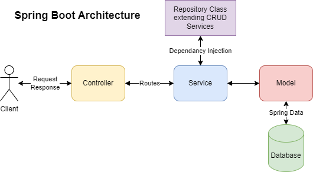

# Spring Boot CRUD API Server

This repository contains a simple Spring Boot CRUD API server that demonstrates the Spring Boot architecture with various layers, including Controller, Service, Repository, Model, and H2 in-memory Database.




## Table of Contents

- [Introduction](#introduction)
- [Features](#features)
- [Technologies Used](#technologies-used)
- [Project Structure](#project-structure)
- [Getting Started](#getting-started)
- [API Endpoints](#api-endpoints)
- [Testing](#testing)
- [Contributing](#contributing)
- [License](#license)

## Introduction

Just want to document this basic Spring Boot architecture with a model (`User`), a repository for data access, a service for business logic, and a controller for handling HTTP requests. Extend and customize each layer as required for future projects.


## Features

- CRUD API Server

## Technologies Used

- [Spring Boot](https://spring.io/projects/spring-boot): Main framework for building the application.
- [H2 Database](https://www.h2database.com/): In-memory database for development and testing.
- (Add any other technologies used in your project)

## Project Structure

Directory tree is as follows:

```
D:.
├───.mvn
│   └───wrapper
├───.vscode
├───src
│   ├───main
│   │   ├───java
│   │   │   └───sean
│   │   │       └───spring_architecture_demo
│   │   │           ├───controller
│   │   │           ├───http
│   │   │           ├───model
│   │   │           ├───repository
│   │   │           └───service
│   │   └───resources
│   │       ├───static
│   │       └───templates
│   └───test
│       └───java
│           └───sean
│               └───spring_architecture_demo
└───target
    ├───classes
    │   └───sean
    │       └───spring_architecture_demo
    ├───generated-sources
    │   └───annotations
    ├───generated-test-sources
    │   └───test-annotations
    └───test-classes
```

## Getting Started

The architecture of a Spring Boot application typically involves multiple layers, such as the controller layer, service layer, and data access layer. Here's a simple example to demonstrate the basic architecture of a Spring Boot application:

1. **Create a Spring Boot Project:**
You can use Spring Initializr (https://start.spring.io/) to generate a new Spring Boot project.
2. **Use an Embedded Database:**
Use H2 for testing or simplicity. Add the following to your **`pom.xml`**:

```xml
xmlCopy code
<dependency>
    <groupId>com.h2database</groupId>
    <artifactId>h2</artifactId>
    <scope>runtime</scope>
</dependency>

```

Add JDBC URL in your **`application.properties`**:

```
propertiesCopy code
spring.datasource.url=jdbc:h2:mem:testdb
spring.datasource.driver-class-name=org.h2.Driver
spring.datasource.username=sa
spring.datasource.password=
```

Generate Test Data

```java
-- src/main/resources/data.sql

CREATE TABLE IF NOT EXISTS app_user (
    id BIGINT AUTO_INCREMENT PRIMARY KEY,
    username VARCHAR(255) NOT NULL,
    email VARCHAR(255) NOT NULL
);

INSERT INTO app_user (username, email) VALUES
('sean_wong', 'sean.wong@example.com'),
('alice_lim', 'alice.lim@example.com'),
('bob_lee', 'bob.lee@example.com'),
('joe_biden', 'joe.biden@example.com'),
('michael_jackson', 'michael.jackson@example.com');
```

Populate Test Data when application starts

 

```java
# JPA settings
spring.jpa.show-sql=true
# Set hibernate.hbm2ddl.auto to "create" for schema creation
spring.jpa.hibernate.ddl-auto=update
```

3. **Define a Model:**
Create a simple model class representing an entity in your application.

```java
// User.java
package sean.spring_architecture_demo.model;

import jakarta.persistence.Entity;
import jakarta.persistence.GeneratedValue;
import jakarta.persistence.GenerationType;
import jakarta.persistence.Id;
import jakarta.persistence.Table;
import lombok.Data;

@Data
@Entity
@Table(name = "app_user") // Choose a different table name, for example, "app_user"
public class User {
    @Id
    @GeneratedValue(strategy = GenerationType.IDENTITY)
    private Long id;
    private String username;
    private String email;

    // Other fields, constructors, getters, setters, etc.
}
```

4. **Create a Repository:**
Create a repository interface that extends `JpaRepository` for data access.

```java
// UserRepository.java
package sean.spring_architecture_demo.repository;

import org.springframework.data.jpa.repository.JpaRepository;
import org.springframework.data.jpa.repository.Modifying;
import org.springframework.data.jpa.repository.Query;
import org.springframework.stereotype.Repository;
import sean.spring_architecture_demo.model.User;
import java.util.List;

@Repository
public interface UserRepository extends JpaRepository<User, Long> {

    // Custom query for retrieving a user by ID
    User getUserById(Long id);

    // Custom query for updating (saving) an existing user by ID
    @Modifying
    @Query("UPDATE User u SET u.username = :username, u.email = :email WHERE u.id = :id")
    int updateUserById(Long id, String username, String email);

    // Custom query for retrieving all users
    List<User> findAll();

    // Custom query for deleting a user by ID
    void deleteById(Long id);
}
```

5. **Create a Service:**
Create a service class that provides business logic. In this example, we'll create a simple service for managing users.

```java
// UserService.java
package sean.spring_architecture_demo.service;

import java.util.List;
import sean.spring_architecture_demo.model.User;

public interface UserService {
    User getUserById(Long id);
    List<User> getAllUsers();
    void saveUser(User user);
    void updateUser(Long id, User updatedUser);
    void deleteUser(Long id);
}
```

```java
// UserServiceImpl.java
package sean.spring_architecture_demo.service;

import org.springframework.beans.factory.annotation.Autowired;
import org.springframework.stereotype.Service;

import jakarta.transaction.Transactional;
import sean.spring_architecture_demo.model.User;
import sean.spring_architecture_demo.repository.UserRepository;
import java.util.List;

@Service
public class UserServiceImpl implements UserService {

    @Autowired
    private UserRepository userRepository;

    @Override
    public User getUserById(Long id) {
        return userRepository.findById(id).orElse(null);
    }

    @Override
    public List<User> getAllUsers() {
        return userRepository.findAll();
    }

    @Override
    @Transactional
    public void saveUser(User user) {
        userRepository.save(user);
    }

    @Override
    @Transactional
    public void updateUser(Long id, User updatedUser) {
        userRepository.updateUserById(id, updatedUser.getUsername(), updatedUser.getEmail());
    }

    @Override
    @Transactional
    public void deleteUser(Long id) {
        userRepository.deleteById(id);
    }
}
```

6. **Create a Controller:**
Create a controller class that handles HTTP requests.

```java
// UserController.java
package sean.spring_architecture_demo.controller;

import org.springframework.beans.factory.annotation.Autowired;
import org.springframework.web.bind.annotation.*;
import sean.spring_architecture_demo.model.User;
import sean.spring_architecture_demo.service.UserService;

import java.util.List;

@RestController
@RequestMapping("/api/v1/users")
public class UserController {

    @Autowired
    private UserService userService;

    @GetMapping("/{id}")
    public User getUserById(@PathVariable Long id) {
        return userService.getUserById(id);
    }

    @GetMapping
    public List<User> getAllUsers() {
        return userService.getAllUsers();
    }

    @PostMapping
    public void saveUser(@RequestBody User user) {
        userService.saveUser(user);
    }

    @PutMapping("/{id}")
    public void updateUser(@PathVariable Long id, @RequestBody User updatedUser) {
        userService.updateUser(id, updatedUser);
    }

    @DeleteMapping("/{id}")
    public void deleteUser(@PathVariable Long id) {
        userService.deleteUser(id);
    }
}
```

7. **Run the Application:**
Run your Spring Boot application. You can use the `main` method in the `DemoApplication` class generated by Spring Initializr.

```java
package sean.spring_architecture_demo;
import org.springframework.boot.SpringApplication;
import org.springframework.boot.autoconfigure.SpringBootApplication;

@SpringBootApplication
public class SpringArchitectureDemoApplication {

	public static void main(String[] args) {
		SpringApplication.run(SpringArchitectureDemoApplication.class, args);
	}

}
```

## Testing

Test the APIs using an API client like Postman

```
### http-test.http
### Pre-requisite: 

### Show all users
GET http://localhost:8080/api/v1/users
Content-Type: application/json

### Show user by selecting id
GET http://localhost:8080/api/v1/users/1
Content-Type: application/json

### Add user 
POST http://localhost:8080/api/v1/users
Content-Type: application/json

{
  "id": null,
  "username": "added_user",
  "email": "added.user@example.com"
}

### Update user -- assuming added_user is added at id==6
PUT http://localhost:8080/api/v1/users/6
Content-Type: application/json

{
  "username": "named_one",
  "email": "named.one@example.com"
}

### Delete user -- assuming added_user is added at id==6
DELETE http://localhost:8080/api/v1/users/6
Content-Type: application/json
```


## API Endpoints

Pending

## Contributing

Feel free to contribute.

## License

This is Just a template for my own reference. Not licensed